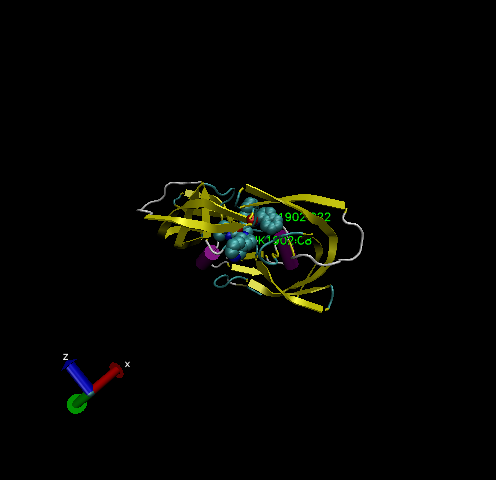

## 1. Intro to the RCSB Protein Data Bank (PDB)

Read the PDB file
```{r}
db <- read.csv("Data Export Summary.csv", row.names=1)
head(db)
```

> **Q1**: What percentage of structures in the PDB are solved by X-Ray and Electron Microscopy.

```{r}
method.sums <- colSums(db)
round((method.sums/method.sums["Total"]) * 100,2)
```

> **Q2**: What proportion of structures in the PDB are protein?

```{r}
type.sums <- rowSums(db)
round( (db$Total/method.sums["Total"]) * 100,2)
```

> **Q3**: Type HIV in the PDB website search box on the home page and determine how many HIV-1 protease structures are in the current PDB?

1828 protease structures


## 2. Visualizing the HIV-1 protease structure

> **Q4**: Water molecules normally have 3 atoms. Why do we see just one atom per water molecule in this structure?

Hydrogen is too small to visualize. Oxygen (HOH) is the only atom shown in water molecules.

> **Q5**: There is a conserved water molecule in the binding site. Can you identify this water molecule? What residue number does this water molecule have?

The water molecule is HOH:308:O. It is important for the binding affinity.

# VMD structure visualization image
*Note: On PCs, you cannot directly save the image as its desired name. You must browse to where you want to save so that the application has permission to render.*



# Using Bio3D

Load the library
```{r}
library(bio3d)

pdb <- read.pdb("1hsg.pdb")
pdb
```

Extract sequence from file
```{r}
pdbseq(pdb)
```

Three-letter codes of the AA sequence
```{r}
aa123(pdbseq(pdb))
```

The ATOM records
```{r}
head(pdb$atom)
```


