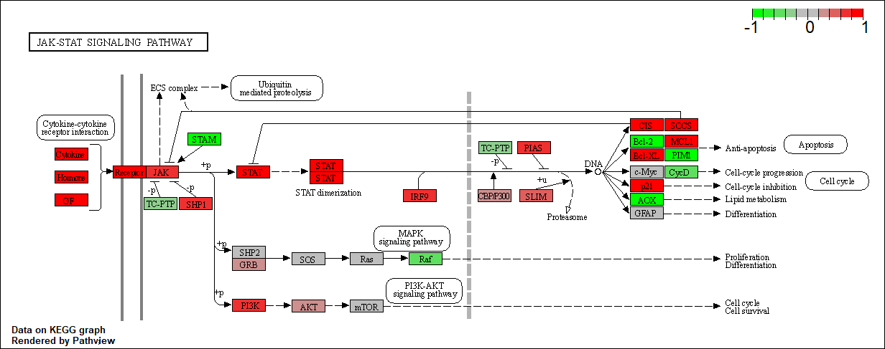
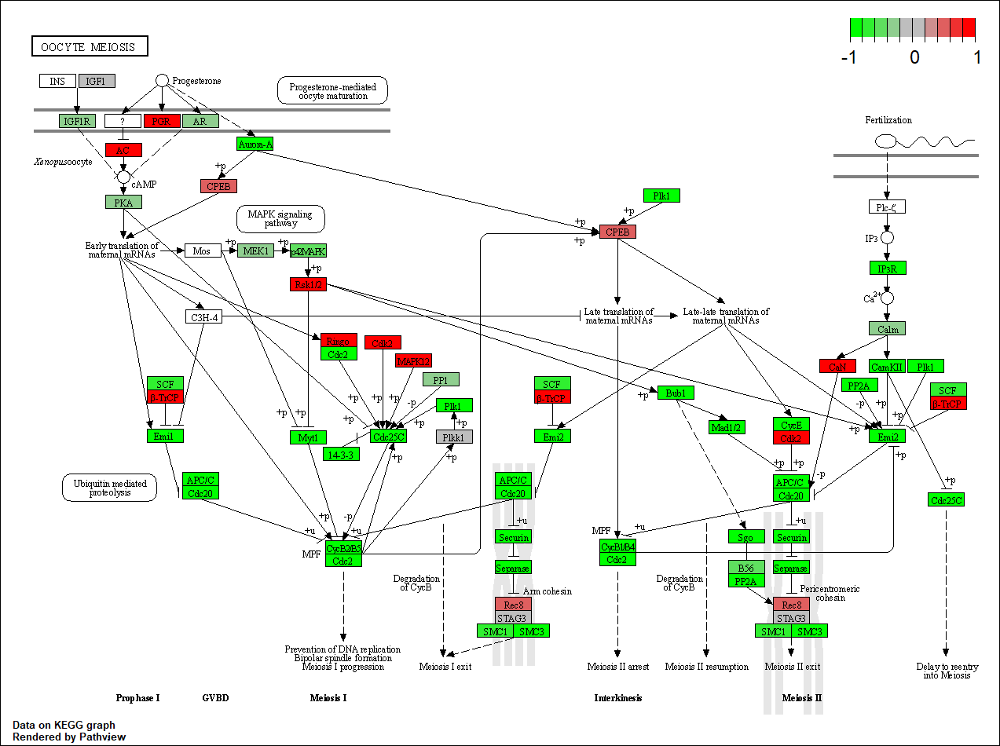

# Background

The data for for hands-on session comes from GEO entry: GSE37704, which is associated with the following publication:

> Trapnell C, Hendrickson DG, Sauvageau M, Goff L et al. "Differential analysis of gene regulation at transcript resolution with RNA-seq". Nat Biotechnol 2013 Jan;31(1):46-53. PMID: 23222703

The authors report on differential analysis of lung fibroblasts in response to loss of the developmental transcription factor HOXA1. Their results and others indicate that HOXA1 is required for lung fibroblast and HeLa cell cycle progression. In particular their analysis show that "loss of HOXA1 results in significant expression level changes in thousands of individual transcripts, along with isoform switching events in key regulators of the cell cycle". For our session we have used their Sailfish gene-level estimated counts and hence are restricted to protein-coding genes only.


## 1. Load our data files: data import
```{r}
metaFile <- "GSE37704_metadata.csv"
countFile <- "GSE37704_featurecounts.csv"

# Import metadata and take a peek
colData = read.csv(metaFile, row.names=1)
head(colData)
```

```{r}
# Import countdata
countData = read.csv(countFile, row.names=1)
head(countData)
```

We need to get rid of this funny first column. The `countData` and `colData` files need to match up.

> **Q1**. Complete the code below to remove the troublesome first column from `countData`.

```{r}
head(as.matrix(countData))
```

```{r}
countData2 <- as.matrix(countData[ , -1])
head(countData2)
```

> **Q2**. Complete the code below to filter countData to exclude genes (i.e. rows) where we have 0 read count across all samples (i.e. columns).

> Tip: What will rowSums() of countData return and how could you use it in this context?

```{r}
countData3 = countData2[rowSums(countData2) > 0, ]
head(countData3)
```


## 2. DESeq analysis

```{r}
library(DESeq2)
```

```{r}
dds = DESeqDataSetFromMatrix(countData=countData3,
                             colData=colData,
                             design=~condition)
dds = DESeq(dds)
```

Get the results

```{r}
res <- results(dds)
head(res)
```

> **Q3**. Call the summary() function on your results to get a sense of how many genes are up or down-regulated at the default 0.1 p-value cutoff.

```{r}
summary(res)
```


## 3. Volcano plot

```{r}
plot( res$log2FoldChange, -log(res$padj) )
```

> **Q4**. Improve this plot by completing the below code, which adds color and axis labels.

```{r}
# Make a color vector for all genes
mycols <- rep("gray", nrow(res) )

# Color red the genes with absolute fold change above 2
mycols[ abs(res$log2FoldChange) > 2 ] <- "red"

# Color blue those with adjusted p-value less than 0.01
#  and absolute fold change more than 2
inds <- (res$padj < 0.01) & (abs(res$log2FoldChange) > 2 )
mycols[ inds ] <- "blue"

plot( res$log2FoldChange, -log(res$padj), col=mycols, xlab="Log2(FoldChange)", 
      ylab="-Log(P-value)" )
```

# Adding gene annotation

Here we use the AnnotationDbi package to add gene symbols and entrez ids to our results.

> **Q5**.Use the `mapIDs()` function multiple times to add SYMBOL, ENTREZID and GENENAME annotation to our results by completing the code below.

```{r}
library(AnnotationDbi)
library(org.Hs.eg.db)
```

Quick reminder of what ID types are available in the orgHs.eg.db dataset

```{r}
columns(org.Hs.eg.db)
```
```{r}
res$symbol = mapIds(org.Hs.eg.db,
                    keys=row.names(res), 
                    keytype="ENSEMBL",
                    column="SYMBOL",
                    multiVals="first")

res$entrez = mapIds(org.Hs.eg.db,
                    keys=row.names(res),
                    keytype="ENSEMBL",
                    column="ENTREZID",
                    multiVals="first")

res$name =   mapIds(org.Hs.eg.db,
                    keys=row.names(res),
                    keytype="ENSEMBL",
                    column="GENENAME",
                    multiVals="first")

head(res, 10)
```

> **Q6**. Finally for this section let's reorder these results by adjusted p-value and save them to a CSV file in your current project directory.

```{r}
res = res[order(res$pvalue),]
write.csv(res, file="deseq_results.csv")
```

## Section 2. Pathway Analysis

Install and load the Bioconductor packages
- BiocManager::install( c("pathview", "gage", "gageData") )
```{r}
library(pathview)
library(gage)
library(gageData)

data(kegg.sets.hs)
data(sigmet.idx.hs)

# Focus on signaling and metabolic pathways only
kegg.sets.hs = kegg.sets.hs[sigmet.idx.hs]

# Examine the first 3 pathways
head(kegg.sets.hs, 3)
```

The main **gage()** function requires a named vector of fold changes, where the names of the values are the Entrez gene IDs.

Note that we used the **mapIDs()** function above to obtain Entrez gene IDs (stored in `res$entrez`) and we have the fold change results from DESeq2 analysis (stored in `res$log2FoldChange`).

```{r}
foldchanges = res$log2FoldChange
names(foldchanges) = res$entrez
head(foldchanges)
```

Now, let's run the **gage** pathway analysis and look at the object returned from **gage()**.

```{r}
# Get the results
keggres = gage(foldchanges, gsets=kegg.sets.hs)

attributes(keggres)

# Look at the first few down (less) pathways
head(keggres$less)
```

Each `keggres$less` and `keggres$greater` object is data matrix with gene sets as rows sorted by p-value.

The top "less/down" pathways is "Cell cycle" with the KEGG pathway identifier `hsa04110`.

Now, let's try out the **pathview()** function from the pathview package to make a pathway plot with our RNA-Seq expression results shown in color.
To begin with lets manually supply a pathway.id (namely the first part of the `"hsa04110 Cell cycle"`) that we could see from the print out above.

```{r}
pathview(gene.data=foldchanges, pathway.id="hsa04110")
```


Now, let's process our results a bit more to automagicaly pull out the top 5 upregulated pathways, then further process that just to get the pathway IDs needed by the **pathview()** function. We'll use these KEGG pathway IDs for pathview plotting below.

```{r}
## Focus on top 5 upregulated pathways here for demo purposes only
keggrespathways <- rownames(keggres$greater)[1:5]

# Extract the 8 character long IDs part of each string
keggresids = substr(keggrespathways, start=1, stop=8)
keggresids
```

Finally, lets pass these IDs in keggresids to the **pathview()** function to draw plots for all the top 5 pathways.

```{r}
pathview(gene.data=foldchanges, pathway.id=keggresids, species="hsa")
```

Here are the pathways:





> **Q7**. Can you do the same procedure as above to plot the pathway figures for the top 5 down-regulated pathways?

```{r}
## Focus on top 5 downregulated pathways
keggrespathways2 <- rownames(keggres$less)[1:5]

# Extract the 8 character long IDs part of each string
keggresids2 = substr(keggrespathways2, start=1, stop=8)
keggresids2
```

Generate the pathways

```{r}
pathview(gene.data=foldchanges, pathway.id=keggresids2, species="hsa")
```





## Section 3. Gene Ontology (GO)

We can also do a similar procedure with gene ontology. Similar to above, **go.sets.hs** has all GO terms. **go.subs.hs** is a named list containing indexes for the BP, CC, and MF ontologies. Let’s focus on BP (a.k.a Biological Process) here.

```{r}
data(go.sets.hs)
data(go.subs.hs)

# Focus on Biological Process subset of GO
gobpsets = go.sets.hs[go.subs.hs$BP]

gobpres = gage(foldchanges, gsets=gobpsets, same.dir=TRUE)

lapply(gobpres, head)
```


## Section 4. Reactome Analysis

First, using R, output the list of significant genes at the 0.05 level as a plain text file:

```{r}
sig_genes <- res[res$padj <= 0.05 & !is.na(res$padj), "symbol"]
print(paste("Total number of significant genes:", length(sig_genes)))
```

```{r}
write.table(sig_genes, file="significant_genes.txt", row.names=FALSE, 
            col.names=FALSE, quote=FALSE)
```

> **Q8**. What pathway has the most significant “Entities p-value”? Do the most significant pathways listed match your previous KEGG results? What factors could cause differences between the two methods?

Endosomal/Vacuolar pathway has the lowest p-value, or most significant Entities p-value. The most significant pathways listed differ slightly from our previous KEGG results. Reactome is a database consisting of biological molecules, whereas KEGG is a named list of 229 elements. There are different amounts and types of biomolecules bewteen the two databases, leading to these differences. KEGG also screens for larger parameters and combines various pathways into a generic, "clearn" gene set of signaling and metabolic pathways only.
